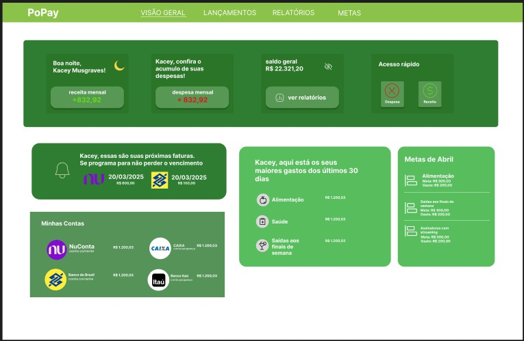
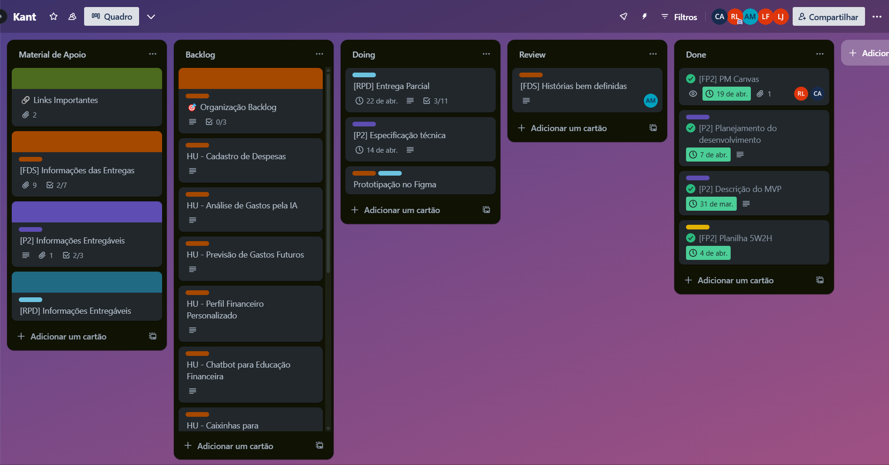
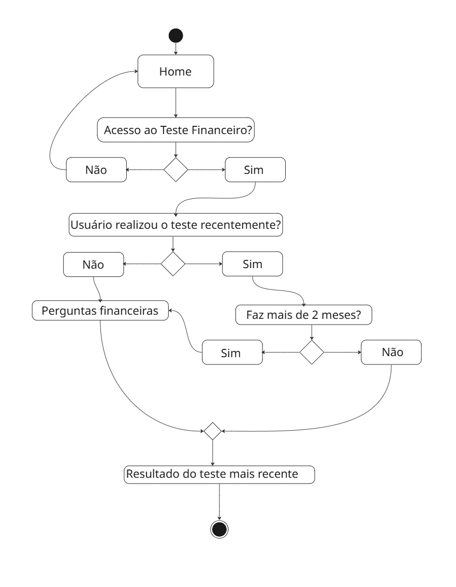

# 💸 Popay

> Um sistema inteligente de gestão financeira feito para jovens que querem sair do ciclo de dívidas e conquistar estabilidade.

## 🧠 Sobre o Popay

Diante do aumento do endividamento entre os jovens, **Popay** surge como uma solução tecnológica para transformar a maneira como eles lidam com o dinheiro. Utilizando **Inteligência Artificial**, o sistema:

- Analisa hábitos de consumo;
- Prevê meses com maior probabilidade de gastos;
- Sugere ajustes e estratégias de economia;
- Cria **perfis financeiros personalizados**, com base no comportamento individual.

Nosso objetivo é proporcionar **autonomia financeira**, ajudando o usuário a **evitar dívidas**, **equilibrar as finanças** e garantir um futuro **mais seguro e planejado**.

## ❗ Problema que buscamos resolver

O endividamento entre jovens tem crescido de forma alarmante, impulsionado por:

- Falta de educação financeira;
- Assumir compromissos financeiros a longo prazo, sem planejamento;
- Hábitos de consumo imediatistas e descontrolados.

## 🗓️ Quadro do Trello

- 🛠️ [Quadro do Projeto (Trello)](https://trello.com/b/dO0Dct2b/kant)

## 👤 Histórias do Usuário

> Algumas histórias que guiaram o desenvolvimento do Popay:

- **Cadastro de Despesas**
- **Dashboard de Visualização Financeira**
- **Análise de Gastos pela IA**
- **Integração com Open Finance**
- **Alertas de Gastos Acima da Média**

## 🛠️ Tecnologias Utilizadas

- **React** – Biblioteca JavaScript para construção de interfaces de usuário dinâmicas e reutilizáveis.
- **JavaScript** – Interface interativa e responsiva  
- **HTML5 / CSS3** – Estrutura e estilo da aplicação web  

## 🧰 Softwares Utilizados

- **VS Code** – Ambiente de desenvolvimento  
- **Figma** – Prototipagem e design da interface  
- **GitHub** – Controle de versão e colaboração  
- **Trello** – Organização de tarefas e planejamento do projeto  

## 🔗 Links Úteis

- 💻 [Protótipo no Figma](https://www.figma.com/design/xW5kSDpCFAY1aso8I3pBcp/Prot%C3%B3tipo?node-id=0-1&t=6wwaZKyyYY2JTfe8-1)  
- 📂 [Drive](https://drive.google.com/drive/u/0/folders/0AKdHeB0ZGGWqUk9PVA)
- 🗓️ [Quadro do Projeto (Trello)](https://trello.com/b/dO0Dct2b/kant)
- 📽️ [Screencast](https://drive.google.com/file/d/1WJ8IebUwy1qDaKhoAmJtveuAp5HvDQtb/view?usp=sharing)

## 👥 Equipe

- Ana Sofia da Silva Moura  
- Camila Maria Teixeira Alcântara
- Lucas Rodrigues da Silva Junior
- René Melo de Lucena

## Sprint 1 ♾️

**Programação em Par**:

  - História do usuário - Cadastro de Despesas
      - Programador piloto: René Melo de Lucena
      - Programador copiloto: Ana Sofia da Silva Moura
      
  - História do usuário - Dashboard de vizualização financeira
      - Programador piloto: Lucas Rodrigues da Silva Junior
      - Programador copiloto: Camila Maria Teixeira Alcântara

  - História do usuário - Teste de perfil financeiro
    
     
     
      - Programador piloto: Ana Sofia da Silva Moura  
      - Programador copiloto: Camila Maria Teixeira Alcântara

    
